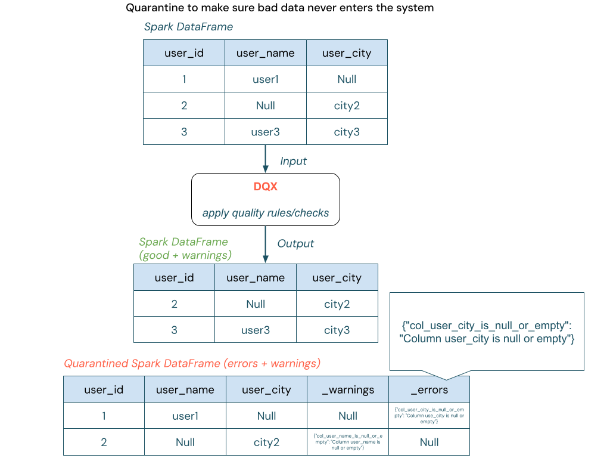
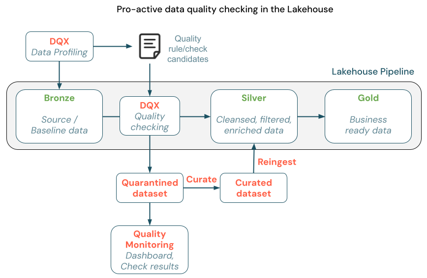

DQX by Databricks Labs
===

    

Simplified Data Quality checking at Scale for PySpark Workloads on streaming and standard DataFrames.

 
 

 

# Motivation

Current data quality frameworks often fall short in providing detailed explanations for specific row or column 
data quality issues and are primarily designed for complete datasets, 
making integration into streaming workloads difficult.

This project introduces a simple Python validation framework for assessing data quality of PySpark DataFrames. 
It enables real-time quality validation during data processing rather than relying solely on post-factum monitoring.
The validation output includes detailed information on why specific rows and columns have issues, 
allowing for quicker identification and resolution of data quality problems.

Invalid data can be quarantined to make sure bad data is never written to the output.

In the Lakehouse architecture, the validation of new data should happen at the time of data entry into the Curated Layer 
to make sure bad data is not propagated to the subsequent layers. With DQX you can easily quarantine invalid data and re-ingest it 
after curation to ensure that data quality constraints are met.

For monitoring the data quality of already persisted data in a Delta table (post-factum monitoring), we recommend to use 
[Databricks Lakehouse Monitoring](https://docs.databricks.com/en/lakehouse-monitoring/index.html).

# Documentation

The full documentation is available at [https://databrickslabs.github.io/dqx/](https://databrickslabs.github.io/dqx/).

# Contribution

See contribution guidance [here](https://databrickslabs.github.io/dqx/docs/dev/contributing/) on how to contribute to the project (build, test, and submit a PR).

# Project Support

Please note that this project is provided for your exploration only and is not 
formally supported by Databricks with Service Level Agreements (SLAs). They are 
provided AS-IS, and we do not make any guarantees of any kind. Please do not 
submit a support ticket relating to any issues arising from the use of this project.

Any issues discovered through the use of this project should be filed as GitHub 
[Issues on this repository](https://github.com/databrickslabs/dqx/issues). 
They will be reviewed as time permits, but no formal SLAs for support exist.
