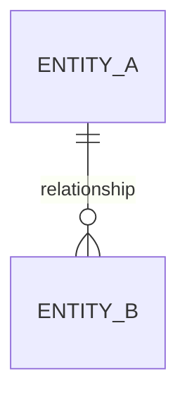

# Authoring Documentation

This document provides guidelines for writing documentation for the DQX project.

## Tech Stack[​](#tech-stack "Direct link to Tech Stack")

The DQX documentation is built using [Docusaurus](https://docusaurus.io/), a modern static site generator.

Docusaurus is a Facebook open source project used by many open source projects to build their documentation websites.

We also use [MDX](https://mdxjs.com/) to write markdown files that include JSX components. This allows us to write markdown files with embedded React components.

For styling, we use [Tailwind CSS](https://tailwindcss.com/), a utility-first CSS framework for rapidly building custom designs.

API docs are generated using [pydoc-markdown](https://github.com/pypa/pydoc-markdown).

## Writing Documentation[​](#writing-documentation "Direct link to Writing Documentation")

Most of the documentation is written in markdown files with the `.mdx` extension. The markdown files are located in the `docs` directory of the DQX project.

## Prerequisites[​](#prerequisites "Direct link to Prerequisites")

Before you start writing documentation, make sure you have the following tools installed on your machine:

* [Node.js](https://nodejs.org/en/)
* [Yarn](https://yarnpkg.com/)

On macOS, you can install Node.js and Yarn using [Homebrew](https://brew.sh/):

```bash
brew install node
npm install --global yarn

```

## Setup[​](#setup "Direct link to Setup")

To set up the documentation locally, follow these steps:

1. Clone the DQX repository
2. Run:

```bash
make docs-install
make docs-build

```

## Running the documentation locally[​](#running-the-documentation-locally "Direct link to Running the documentation locally")

To run the documentation locally, use the following command:

```bash
make docs-serve-dev

```

## Checking search functionality[​](#checking-search-functionality "Direct link to Checking search functionality")

Tip

We are using local search, which won't be available in the development server.

To check the search functionality, run the following command:

```bash
make docs-serve

```

## Diagrams[​](#diagrams "Direct link to Diagrams")

Use [Mermaid](https://mermaid.js.org/) for entity-relationship or flow diagrams. Wrap code in a `mermaid` code block:

````md


````

See [Table Schemas and Relationships](/dqx/docs/reference/table_schemas.md) for an example. Mermaid is enabled via `@docusaurus/theme-mermaid` (version must match `@docusaurus/core`).

## Adding images[​](#adding-images "Direct link to Adding images")

To add images to your documentation, place the image files in the `static/img` directory.

To include an image in your markdown file, use the following syntax:

```markdown


```

Tip

Images support zooming features out of the box.

For cases when images have transparent backgrounds, use the following syntax:

```jsx
<div className='bg-gray-100 p-4 rounded-lg'>
  
</div>

```

This will add a gray background to the image and round the corners.

## Linking pages[​](#linking-pages "Direct link to Linking pages")

It is **strongly** recommended to make all links absolute. By doing so we ensure that it's easy to move files without losing links inside them.

To add an absolute link, use this syntax:

```md
[link text](/docs/folder/file_name)

```

Always start with `/docs`. The file extension `.md` or `.mdx` can be omitted.

To add an anchor to a specific heading, use this syntax:

```md
[link with anchor](/docs/folder/file_name#anchor)

```

After writing docs, run this command:

```text
make docs-build

```

It will throw an error on any unresolved link.

## Content alignment and structure of folders[​](#content-alignment-and-structure-of-folders "Direct link to Content alignment and structure of folders")

When writing documentation, make sure to align the content with the existing documentation.

The rule of thumb is:

* Do not put any technical details in the main documentation.
* All technical details should be kept in the `/docs/dev/` section.

No need for:

* Source code links
* Deep technical details
* Implementation details

Or any other details that are not necessary for the **end-user**.

## API Documentation[​](#api-documentation "Direct link to API Documentation")

The API docs are generated in the `docs/dqx/docs/reference/api` directory.

To generate API docs, run the following command:

```shell
hatch run docs:pydoc-markdown

```

This command is run also as part of make docs build and server. The command will generate the API documentation from the Python codebase using pydoc-markdown.

For best practices on writing docstrings, refer to this [guidance](/dqx/docs/dev/contributing.md#writing-docstrings).
