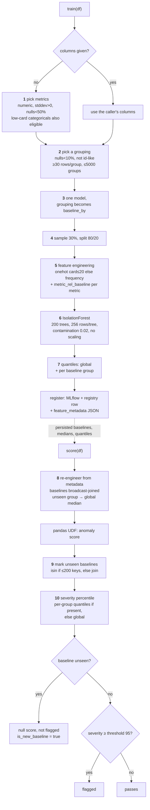

---

title: Anomaly heuristic map

sidebar_position: 645

---

# Anomaly Detection Heuristic Map

Every decision row anomaly detection makes on the way from a DataFrame to a flagged row, with the
default that governs it. It exists to make a bad result diagnosable by working down a path, rather
than by reading the module.

Training and scoring are two passes over the same feature-engineering code: training persists what
scoring later reads back. Diamonds are branches.



There is one model whatever the grouping. `baseline_by` conditions each metric against its own
group's baseline rather than training a model per group; if it is not declared, stage 2 may discover
one. A column named both as a metric and as a baseline is rejected, as are floating-point and decimal
baseline columns (Spark and Python format them differently, which would break the key lookup).

## Reading a bad result

Working down the path, three questions separate most failures.

**What was chosen?** Stages 1 and 2 decide silently, and both defects found while building this map
were there.

```sql
SELECT identity.model_name, training.columns, grouping.baseline_by
FROM <registry_table>
WHERE identity.status = 'active'
```

**Did conditioning engage, and on what?** Look for `<metric>_rel_baseline` in
`engineered_feature_names`, and count the entries in `baseline_medians`. Three groups where the data
has ninety means stage 2 chose too coarsely — a model can be conditioned and still be conditioned on
almost nothing.

**Is the comparison even valid?** Training samples 30% of rows by default via `.sample`, and splits
80/20 via `.randomSplit`; under Spark Connect both depend on partition ordering. Two runs of identical
code can therefore train on different rows. If you are comparing two builds, set
`sample_fraction=1.0` first — otherwise you are measuring the sampler. Suspect stage 4 before
suspecting the design.

## Defaults in one place

| Default | Value | Governs |
|---|---|---|
| `MIN_ROWS_PER_BASELINE_GROUP` | 30 | rows/group needed to trust a baseline median |
| `MAX_BASELINE_GROUPS` | 5000 | ceiling on total baseline groups |
| `MAX_BASELINE_COLUMN_CARDINALITY` | 50 | per-column ceiling for a baseline column |
| `DEFAULT_SAMPLE_FRACTION` | 0.3 | share of rows used for training |
| `DEFAULT_TRAIN_RATIO` | 0.8 | train/validation split |
| `categorical_cardinality_threshold` | 20 | one-hot below, frequency-encode above |
| `num_trees` | 200 | Isolation Forest size |
| `max_samples` | 256 | sklearn "auto"; rows per tree |
| `expected_anomaly_rate` | 0.02 | becomes contamination when unset |
| `threshold` | 95.0 | severity percentile that flags a row |

## Known weak points

Measured, with the evidence in `benchmarks/anomaly_conditioning/`:

- **Stage 1 can pick dimensions as metrics.** Low-cardinality categoricals qualify as features, so a
  table keyed by several dimensions can produce a dozen one-hot columns beside a single real metric,
  diluting the signal. Largely avoided when those columns are recognised as a grouping instead, since
  the profiler removes the grouping from the feature list — but a categorical that is *not* selected
  as a grouping can still land in features.
- **Stage 6 has a blind spot.** Isolation Forest loses to a max-abs-z baseline where anomalies are
  single-feature extremes in few dimensions, and in high dimension. Not fixable by tuning, and adding
  a complementary scorer measured worse on average — see `complementary_detector.py`.
- **Stage 8's fallback is silent by design.** A group absent at training falls back to the global
  baseline, which makes the row read as ordinary rather than extreme. `is_new_baseline` is how that
  case is detected; it is the conservative direction, not a bug.
