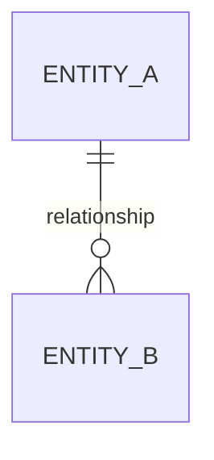

import Admonition from '@theme/Admonition';

# Authoring Documentation

This document provides guidelines for writing documentation for the DQX project.

## Tech Stack

The DQX documentation is built using [Docusaurus](https://docusaurus.io/), a modern static site generator. 

Docusaurus is a Facebook open source project used by many open source projects to build their documentation websites.

We also use [MDX](https://mdxjs.com/) to write markdown files that include JSX components. This allows us to write markdown files with embedded React components.

For styling, we use [Tailwind CSS](https://tailwindcss.com/), a utility-first CSS framework for rapidly building custom designs.

API docs are generated using [pydoc-markdown](https://github.com/pypa/pydoc-markdown).

## Writing Documentation

Most of the documentation is written in markdown files with the `.mdx` extension. 
The markdown files are located in the `docs` directory of the DQX project.

## Prerequisites

Before you start writing documentation, make sure you have the following tools installed on your machine:
- [Node.js](https://nodejs.org/en/)
- [Yarn](https://yarnpkg.com/)

On macOS, you can install Node.js and Yarn using [Homebrew](https://brew.sh/):

```bash
brew install node
npm install --global yarn
```

## Setup 

To set up the documentation locally, follow these steps:

1. Clone the DQX repository
2. Run:

```bash
make docs-install
make docs-build
```

## Running the documentation locally

To run the documentation locally, use the following command:

```bash
make docs-serve-dev
```

## Checking search functionality

<Admonition type="tip" title="Tip" emoji="💡">
We are using local search, which won't be available in the development server.
</Admonition>

To check the search functionality, run the following command:

```bash
make docs-serve
```

## Diagrams

Use [Mermaid](https://mermaid.js.org/) for entity-relationship or flow diagrams. Wrap code in a `mermaid` code block:

````md

````

See [Table Schemas and Relationships](/docs/reference/table_schemas) for an example. Mermaid is enabled via `@docusaurus/theme-mermaid` (version must match `@docusaurus/core`).

## Adding images

To add images to your documentation, place the image files in the `static/img` directory.

To include an image in your markdown file, use the following syntax:

```markdown

```

<Admonition type="tip" title="Tip" emoji="💡">
Images support zooming features out of the box.
</Admonition>

For cases when images have transparent backgrounds, use the following syntax:

```jsx
<div className='bg-gray-100 p-4 rounded-lg'>
  
</div>
```

This will add a gray background to the image and round the corners.

## Linking pages

It is **strongly** recommended to make all links absolute. 
By doing so we ensure that it's easy to move files without losing links inside them. 

To add an absolute link, use this syntax:

```md
[link text](/docs/folder/file_name)
```

Always start with `/docs`. The file extension `.md` or `.mdx` can be omitted. 

To add an anchor to a specific heading, use this syntax:

```md
[link with anchor](/docs/folder/file_name#anchor)
```

After writing docs, run this command:

```
make docs-build
```

It will throw an error on any unresolved link. 

## Tagging features with lifecycle stage and version

Annotate a feature page or subsection with its lifecycle stage and the release it relates to, using 
the components in `src/components/FeatureTags.tsx`. Import the ones you need, then place a `<FeatureTags>` 
row directly **under** the heading (not inline in the `#` line), passing the tags as children with 
`heading={{false}}`:

```mdx
import { FeatureLifecycleStage, AvailableSinceVersion, FeatureTags }
  from '@site/src/components/FeatureTags';

# My Feature

<FeatureTags>
  <AvailableSinceVersion version="0.14.0" heading={{false}} />
  <FeatureLifecycleStage stage="beta" heading={{false}} />
</FeatureTags>
```

This pattern works for page,section, and subsection headings. Use a subsection tag when it documents a
capability that arrived in a *later* release than the page itself (for example a new capability added to
an existing feature). Do not tag structural or explanatory subsections (Overview, Prerequisites, Basic
Usage, Best Practices, Troubleshooting).

Available components:

- `<FeatureLifecycleStage stage="experimental | beta | ga | deprecated" />` — a status badge linked
  to the matching section of the [Feature lifecycle](/docs/reference/feature_lifecycle) reference.
- `<AvailableSinceVersion version="0.14.0" />` — "Available since v0.14.0", linked to that release's notes.
- `<DeprecatedInVersion version="0.16.0" replacement="the new_check function" />` — "Deprecated in
  v0.16.0", with an optional replacement named in the tooltip.
- `<FeatureTags>` — the row container that places the tags on their own line under the heading.

Each tag also accepts `heading` (default `true`) for the rarer case of sitting inline next to
heading text; inside a `<FeatureTags>` row, pass `heading={{false}}` so the badges render at their
normal size.

Version strings are literal props — an annotation records a historical fact tied to a specific
release, so it is set explicitly, not inferred.

<Admonition type="note" title="Keep tags out of the heading line">
Place tags in a `<FeatureTags>` row under the heading, not inside the `#` line. Docusaurus derives
the browser tab title and sidebar label from the raw heading text. A tag left in the heading would
leak the component markup into these elements.
</Admonition>

There is intentionally no "Changed in vX" component. When behavior or a name changes, bump
`AvailableSinceVersion` to the release that introduced the current behavior and document the previous
behavior in an admonition, for example:

```mdx
<Admonition type="note" title="Changed in v0.16.0">
Prior to v0.16.0, this option was called `foo`.
</Admonition>
```

## Content alignment and structure of folders

When writing documentation, make sure to align the content with the existing documentation.

The rule of thumb is:
* Do not put any technical details in the main documentation.
* All technical details should be kept in the `/docs/dev/` section.

No need for:
- Source code links 
- Deep technical details
- Implementation details

Or any other details that are not necessary for the **end-user**.

## API Documentation

The API docs are generated in the `docs/dqx/docs/reference/api` directory.

To generate API docs, run the following command:
```shell
uv run --group docs pydoc-markdown
```

This is the same invocation that `make docs-build` and `make docs-serve-dev` run, so the recommended way is simply `make docs-build`.
The command will generate the API documentation from the Python codebase using pydoc-markdown.

For best practices on writing docstrings, refer to this [guidance](/docs/dev/contributing#writing-docstrings).
