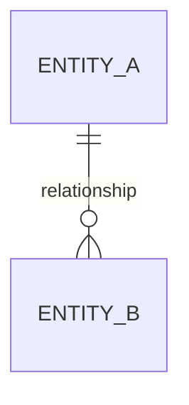

import Admonition from '@theme/Admonition';

# Authoring Documentation

This document provides guidelines for writing documentation for the DQX project.

## Tech Stack

The DQX documentation is built using [Docusaurus](https://docusaurus.io/), a modern static site generator. 

Docusaurus is a Facebook open source project used by many open source projects to build their documentation websites.

We also use [MDX](https://mdxjs.com/) to write markdown files that include JSX components. This allows us to write markdown files with embedded React components.

For styling, we use [Tailwind CSS](https://tailwindcss.com/), a utility-first CSS framework for rapidly building custom designs.

API docs are generated using [pydoc-markdown](https://github.com/pypa/pydoc-markdown).

## Writing Documentation

Most of the documentation is written in markdown files with the `.mdx` extension. 
The markdown files are located in the `docs` directory of the DQX project.

## Prerequisites

Before you start writing documentation, make sure you have the following tools installed on your machine:
- [Node.js](https://nodejs.org/en/)
- [Yarn](https://yarnpkg.com/)

On macOS, you can install Node.js and Yarn using [Homebrew](https://brew.sh/):

```bash
brew install node
npm install --global yarn
```

## Setup 

To set up the documentation locally, follow these steps:

1. Clone the DQX repository
2. Run:

```bash
make docs-install
make docs-build
```

## Running the documentation locally

To run the documentation locally, use the following command:

```bash
make docs-serve-dev
```

## Checking search functionality

<Admonition type="tip" title="Tip" emoji="💡">
We are using local search, which won't be available in the development server.
</Admonition>

To check the search functionality, run the following command:

```bash
make docs-serve
```

## Diagrams

Use [Mermaid](https://mermaid.js.org/) for entity-relationship or flow diagrams. Wrap code in a `mermaid` code block:

````md

````

See [Table Schemas and Relationships](../reference/table_schemas.mdx) for an example. Mermaid is enabled via `@docusaurus/theme-mermaid` (version must match `@docusaurus/core`).

## Adding images

To add images to your documentation, place the image files in the `static/img` directory.

To include an image in your markdown file, use the following syntax:

```markdown

```

<Admonition type="tip" title="Tip" emoji="💡">
Images support zooming features out of the box.
</Admonition>

For cases when images have transparent backgrounds, use the following syntax:

```jsx
<div className='bg-gray-100 p-4 rounded-lg'>
  
</div>
```

This will add a gray background to the image and round the corners.

## Linking pages

Links between docs pages **must be relative links to the target `.mdx` file**, including the
file extension. The docs are [versioned](https://github.com/databrickslabs/dqx/blob/v0.15.0/docs/dqx/versions.json):
the live `docs/` folder is the unreleased ("Pre-Release") version and each release is frozen under
`versioned_docs/`. A relative file link is the only form that resolves **within the same version** —
it points at the versioned copy of the page, and the build still fails if the target file moves or an
anchor is wrong, so we keep the safety of validated links.

Do **not** use absolute links that start with `/docs/`. An absolute link resolves to a single
(default) version regardless of which version the page belongs to. That silently sends a reader on an
older version to the current copy of the page, and breaks the build for a page that does not exist in
the default version (for example an unreleased page linked from Pre-Release docs).

To link to another page, give the path to its `.mdx` file relative to the current file:

```md
<!-- from docs/guide/quality_checks_apply.mdx -->
[link to a sibling page](quality_checks_definition.mdx)
[link to a page in another folder](../reference/testing.mdx)
```

To add an anchor to a specific heading, append it to the file link:

```md
[link with anchor](../reference/testing.mdx#my-heading)
```

Images are version-agnostic assets, so keep referencing them with `useBaseUrl`, e.g.
`useBaseUrl('/img/dqx.png')` — do not make image paths relative.

After writing docs, run this command:

```
make docs-build
```

It will throw an error on any unresolved link or anchor. To preview the unreleased docs as they will
appear (as the "Pre-Release" version), use `make docs-serve`. 

## Content alignment and structure of folders

When writing documentation, make sure to align the content with the existing documentation.

The rule of thumb is:
* Do not put any technical details in the main documentation.
* All technical details should be kept in the `/docs/dev/` section.

No need for:
- Source code links 
- Deep technical details
- Implementation details

Or any other details that are not necessary for the **end-user**.

## API Documentation

The API docs are generated in the `docs/dqx/docs/reference/api` directory.

To generate API docs, run the following command:
```shell
uv run --group docs pydoc-markdown
```

This is the same invocation that `make docs-build` and `make docs-serve-dev` run, so the recommended way is simply `make docs-build`.
The command will generate the API documentation from the Python codebase using pydoc-markdown.

For best practices on writing docstrings, refer to this [guidance](./contributing.mdx#writing-docstrings).
