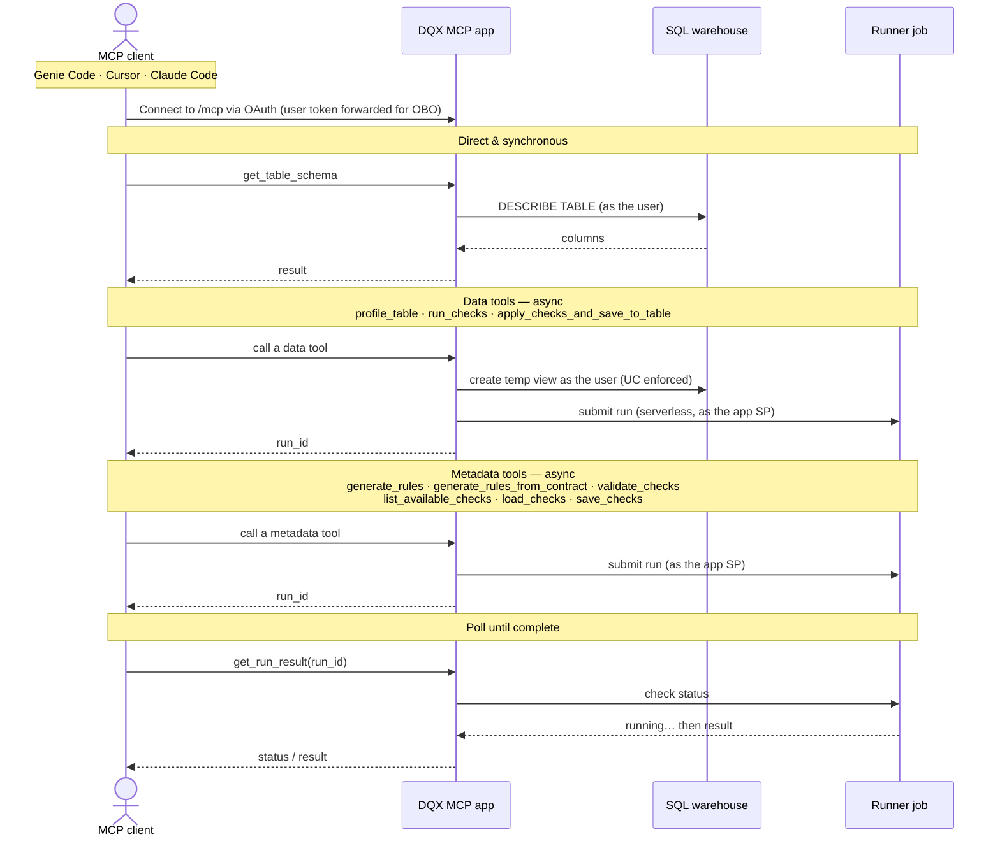

import Admonition from '@theme/Admonition';

# DQX MCP Server

**DQX MCP Server** is an [MCP (Model Context Protocol)](https://modelcontextprotocol.io/) server that exposes DQX data quality tools for AI agents.
It runs as a [Databricks App](https://docs.databricks.com/en/dev-tools/databricks-apps/index.html) inside your workspace with on-behalf-of (OBO) authentication — every operation respects the calling user's Unity Catalog permissions.

<Admonition type="tip" title="When to use the MCP server">
The MCP server is the recommended integration point for:
- AI agents ([Agent Bricks](https://www.databricks.com/product/artificial-intelligence/agent-bricks), Genie Code) that need to profile tables, generate rules, and run quality checks programmatically.
- IDE-based workflows (Cursor, Claude Code) where you want DQX tools available as MCP tools.
- Any MCP-compatible client that needs data quality capabilities without writing DQX code directly.

For interactive, browser-based rule management, see [DQX Studio](/docs/guide/dqx_studio).
For code-level integration into pipelines or notebooks, see the [Programmatic approach](/docs/guide/quality_checks_apply#programmatic-approach).
</Admonition>

## Who this guide is for

There are two reading paths:

- **Platform admins** set up and operate the server: [Prerequisites](#prerequisites) → [Deploy](#deploy) → [Configuration](#configuration) → [Troubleshooting](#troubleshooting) → [Upgrade and uninstall](#upgrade-and-uninstall).
- **Users** — Genie Code users, data engineers, power users — consume it once it's deployed: [Connect an MCP client](#connect-an-mcp-client) → [Usage](#usage) → [Example prompts](#example-prompts). In **Genie Code** you just need the app shared with you and then enable it in settings; other clients (Cursor, Claude Code) use the server's `/mcp` URL — ask your admin.

### Quickstart

**Admins** — set the catalog, deploy, and share the URL (full steps under [Deploy](#deploy)):

```bash
databricks secrets create-scope dqx-config --profile <profile>
databricks secrets put-secret dqx-config catalog_name --string-value "<your_catalog>" --profile <profile>
make mcp-deploy PROFILE=<profile>
databricks apps get mcp-dqx --profile <profile> -o json | jq -r .url   # users in users_group discover it in Genie Code; share <url>/mcp for other clients
```

**Users** — connect and ask (details under [Connect an MCP client](#connect-an-mcp-client)):

1. **Genie Code:** once the DQX app is shared with you (you're in its `users_group`), enable it from **Settings → MCP Servers** — no URL needed. **Cursor / Claude Code:** add a remote MCP server with the URL `https://<app-url>/mcp`.
2. Ask in plain English, e.g. *"Profile `<catalog>.<schema>.<table>` and tell me which rows fail data quality checks."*

## Architecture



**Async pattern:** Long-running tools (profiling, rule generation, validation, running/applying checks, save/load) submit a Databricks job and return a `run_id` immediately — this avoids HTTP timeouts in clients like Genie Code. The client then calls `get_run_result(run_id)` to fetch the outcome. If the job is still running, `get_run_result` returns `{"status": "running"}` and the client calls it again until the run is terminal.

**UC governance:** Tools that read data (`profile_table`, `run_checks`, `apply_checks_and_save_to_table`) create a temporary view using the **user's** OBO token. If the user cannot read the source table, view creation fails — Unity Catalog is enforced end to end. The SP runner job then reads through that view. Each view is dropped by the runner job itself when the operation finishes (a periodic sweeper reaps any orphans as a backstop), so cleanup does not depend on the client polling for results.

## Available tools

| Tool | Description | Execution | Returns |
|------|-------------|-----------|---------|
| `get_workflow` | Get the recommended tool-call sequence | In-process | Workflow JSON |
| `get_table_schema` | Get column names, types, and comments | Direct SQL via OBO | Result directly |
| `profile_table` | Profile data patterns (nulls, ranges, distributions) | OBO view + runner job | `run_id` |
| `generate_rules` | Generate DQX check rules from a profile | Runner job | `run_id` |
| `generate_rules_from_contract` | Generate DQX checks from an ODCS data contract | Runner job | `run_id` |
| `list_available_checks` | List the built-in check functions | Runner job | `run_id` |
| `validate_checks` | Validate check definitions for correctness | Runner job | `run_id` |
| `run_checks` | Execute checks and return a sample of results | OBO view + runner job | `run_id` |
| `save_checks` | Persist checks to a table, UC volume, or workspace file&nbsp;† | Runner job (writes as SP) | `run_id` |
| `load_checks` | Load previously saved checks | Runner job (reads as SP) | `run_id` |
| `apply_checks_and_save_to_table` | Apply checks and write valid / quarantine rows to Delta&nbsp;† | OBO view + runner job (writes as SP) | `run_id` |
| `get_run_result` | Fetch the result (or `running`/`failed` status) of a submitted run | Job status check | Result or status |

† These tools **write** as the app service principal, so the SP needs write access to the target location — see [Write access for the persisting tools](#write-access).

## Prerequisites

Tooling:

- [Databricks CLI](https://docs.databricks.com/dev-tools/cli/install.html) **0.279.0+** (the bundle uses the [direct deployment engine](https://docs.databricks.com/aws/en/dev-tools/bundles/direct), which needs this version). Check with `databricks --version`.

Workspace features (ask a workspace admin to enable any that are missing):

| Feature | Why it's needed |
|---|---|
| **Databricks Apps** | The MCP server runs as a Databricks App. |
| **Serverless compute** | The app and the runner/setup jobs run on serverless. |
| **Unity Catalog** | All data access and grants are UC-governed (OBO). |

Permissions for the **deploying** user (typical names; exact entitlements vary by workspace — if a step is rejected, this table tells you which grant is missing):

| Permission | On | Used by | Symptom if missing |
|---|---|---|---|
| Allow to **create/manage Apps** | workspace | `bundle deploy` (the app) | app creation rejected |
| **Allow cluster create** / serverless entitlement | workspace | runner + setup jobs | job creation rejected |
| **Manage** a secret scope (or an existing one) | workspace | the `catalog_name` secret | `secrets put-secret` rejected |
| **USE CATALOG** + **CREATE SCHEMA** | the target catalog | setup job (creates `<catalog>.tmp`) | `User does not have CREATE SCHEMA` |
| **MANAGE** (or owner) on the catalog | the target catalog | setup job's `GRANT` / `ALTER SCHEMA OWNER` | grant rejected |

An existing Unity Catalog **catalog** must already exist (the setup job creates a schema inside it, not the catalog itself).

## Deploy

### What gets deployed

Deploying the bundle creates four things in your workspace (all prefixed by `name_prefix`, default `mcp-dqx`):

| Resource | Name | Purpose |
|---|---|---|
| Databricks App | `mcp-dqx` | The MCP server (serves `/mcp`); runs as its own app service principal. |
| Job | `mcp-dqx-runner` | Serverless job with `databricks-labs-dqx` installed; tools submit work to it. |
| Job | `mcp-dqx-setup` | One-time setup: creates the temp schema + UC grants. |
| Secret | `dqx-config/catalog_name` | The catalog the app/runner use for temp views (you set this). |

The runner and setup jobs are idempotent and safe to re-run. Nothing here is destroy-protected, so `databricks bundle destroy` removes it all — see [Upgrade and uninstall](#upgrade-and-uninstall).

### 1. Authenticate

```bash
databricks auth login --host https://<your-workspace-url> --profile <profile>
```

### 2. Configure the catalog name (one-time)

The catalog name is stored as a Databricks secret. Both the app and the setup job read from it.

```bash
# Create the secret scope (one-time)
databricks secrets create-scope dqx-config --profile <profile>

# Set the catalog name
databricks secrets put-secret dqx-config catalog_name --string-value "<your_catalog>" --profile <profile>
```

To change the catalog later, update the secret and restart the app.

### 3. Deploy

**One command** (parity with the Studio app's `make app-deploy`):

```bash
make mcp-deploy PROFILE=<profile>
```

This runs `bundle deploy`, the one-time setup job, and then deploys + starts the app. Add `BUNDLE_VARS='--var catalog_name=<catalog>'` to override the catalog, or `TARGET=<target>` for a non-default bundle target.

**Or step by step** (what `make mcp-deploy` runs):

```bash
cd mcp-server

# Deploy the bundle (app + runner job + setup job)
databricks bundle deploy --profile <profile>

# Run the one-time setup job (idempotent)
databricks bundle run dqx_setup --profile <profile>

# Deploy and start the app
databricks bundle run mcp-dqx --profile <profile>
```

The **setup job** reads the catalog name from the secret and:
- Creates the `<catalog>.tmp` schema for temporary views
- Grants `USE CATALOG` on the catalog to all users and the app SP
- Grants `USE SCHEMA` + `CREATE TABLE` on the tmp schema to all users
- Grants `USE SCHEMA` + `SELECT` on the tmp schema to the app SP, and makes the SP the schema owner (so it can drop the OBO-created temp views)

### 4. Find your MCP endpoint

The MCP endpoint is `https://<app-url>/mcp`. Find `<app-url>` in the Databricks UI under **Compute → Apps → mcp-dqx** (the **App URL**), or via the CLI:

```bash
databricks apps get mcp-dqx --profile <profile> -o json | jq -r .url
```

## Configuration

### Security and governance

- **Reads run as the calling user.** `get_table_schema`, and the temporary views behind `profile_table` / `run_checks` / `apply_checks_and_save_to_table`, use the user's OBO token — Unity Catalog is enforced, so a user only ever sees data they are already granted.
- **Jobs and writes run as the app service principal.** The runner job executes under the app SP. `save_checks` and `apply_checks_and_save_to_table` write as the SP, so it needs write grants on the target (see [Write access](#write-access)); the tables they create are auto-granted to the calling user (`ALL PRIVILEGES` + `MANAGE`, so the user can fully manage them while the SP retains ownership).
- **App access is gated.** Only members of `users_group` (default `account users`) receive `CAN_USE` on the app, and the Databricks Apps front-door requires an OAuth login (PATs are rejected).

### Secrets

| Secret Scope | Key | Description |
|-------------|-----|-------------|
| `dqx-config` | `catalog_name` | UC catalog for temp views |

### Bundle variables

| Variable | Description | Default |
|----------|-------------|---------|
| `name_prefix` | Prefix for all resource names (app + jobs). Override to deploy an isolated second copy. | `mcp-dqx` |
| `catalog_name` | Catalog for temp views. Empty ⇒ read from the secret scope (the normal case). | `""` |
| `config_secret_scope` | Secret scope holding `catalog_name`. | `dqx-config` |
| `users_group` | Group granted `CAN_USE` on the app and access to the temp schema. | `account users` |

Override at deploy time (or via `BUNDLE_VARS=` with `make mcp-deploy`):

```bash
databricks bundle deploy --var users_group="users" --profile <profile>
```

### Monitoring

```bash
databricks apps get mcp-dqx --profile <profile>      # status (compute + app state, URL)
databricks apps logs mcp-dqx --profile <profile>     # tail app logs
databricks apps stop mcp-dqx --profile <profile>     # stop the app (e.g. to pause cost)
```

The runner job's per-operation runs are visible under **Workflows → Jobs → mcp-dqx-runner**, which is where tool failures (a failed `run_id`) show their full stack trace.

**Cost and concurrency:** the app runs continuously while deployed (stop it with `databricks apps stop` to pause that cost); the runner jobs are serverless and bill per run, and support up to 10 concurrent runs.

### How it works

1. **Catalog name:** Read from Databricks secret (`dqx-config/catalog_name`) by both the app and the setup job. Update the secret and restart the app to change it.
2. **Async job execution:** Tools trigger the pre-deployed `mcp-dqx-runner` job via `run_now()`, which uses a serverless environment with `databricks-labs-dqx` pre-installed. Jobs support up to 10 concurrent runs.
3. **SQL warehouse:** Auto-discovered at runtime from the user's available warehouses. No configuration needed.
4. **App SP permissions:** Granted automatically by the setup job and the bundle's resource bindings.

### Write access for the persisting tools {#write-access}

<Admonition type="warning" title="save_checks and apply_checks_and_save_to_table write as the app service principal">
Most tools read through the calling user's OBO token, but the two tools that **persist** data — `save_checks` and `apply_checks_and_save_to_table` — write as the **app service principal**. The setup job only grants the SP read access on the temp schema, so writes to your own catalogs/schemas will fail with a permission error until you grant the SP write access to the target location:

```sql
-- Replace <app_sp_application_id> with the app service principal's application ID
-- (Compute > Apps > your app > Authorization), and <catalog>.<schema> with your target.
GRANT USE CATALOG ON CATALOG `<catalog>` TO `<app_sp_application_id>`;
GRANT USE SCHEMA, CREATE TABLE, MODIFY ON SCHEMA `<catalog>`.`<schema>` TO `<app_sp_application_id>`;
```

For a UC **volume** or **workspace file** target, grant the SP the equivalent write permission on that volume/folder instead. If you only ever use the read/analyze tools (profile, generate, validate, run), no extra grant is needed.

Tables these tools create are **owned by the app service principal**, but the **calling user is automatically granted `ALL PRIVILEGES` + `MANAGE`** on them — so you can read, modify, **and drop/alter** the outputs outside the MCP. Ownership deliberately stays with the SP (so repeat overwrite runs keep working and don't depend on a grant you could revoke); if you also want to *own* the tables, point the tools at a schema you own.
</Admonition>

## Connect an MCP client

The app exposes a standard MCP endpoint over Streamable HTTP at `https://<app-url>/mcp`. **Genie Code** (inside Databricks) is the recommended client — it authenticates to the app for you. External IDE clients such as Cursor and Claude Code point at the same URL and complete the Databricks OAuth login; follow each tool's own MCP documentation to add a remote server.

<Admonition type="warning" title="Authentication is OAuth, not PATs">
The Databricks Apps front-door authenticates the caller with **OAuth** and forwards the user's token to the server (on-behalf-of). A **personal access token (PAT) is rejected** by the OBO front-door. Genie Code supplies an OAuth token automatically; external clients complete the Databricks OAuth login flow on first use. Every tool then runs as **you**, so it only sees data your Unity Catalog grants allow.
</Admonition>

### Genie Code (recommended)

Genie Code runs inside your Databricks workspace and authenticates to the app automatically. Because the DQX server is a Databricks App, you don't need its URL — once the app is **shared with you** (your account is in its `users_group`; the deploy grants `CAN_USE` to that group, default `account users`), you discover and enable it from **Settings → MCP Servers** in Genie Code. See the Databricks guide [Add MCP servers to Genie Code](https://docs.databricks.com/aws/en/genie-code/mcp) for the exact steps.

Once enabled, the DQX tools are available and you can ask questions in plain English (see [Example prompts](#example-prompts)).


#### Approving tool actions

The **Actions** setting sets the approval mode for new conversations (you can also override it per conversation). With **Ask first**, you approve each tool before it runs; with **Auto-approve**, tools run automatically (Databricks blocks potentially risky actions). The DQX workflow polls `get_run_result` repeatedly while jobs run, so **Auto-approve** avoids repeated approval prompts for those status checks. See the Databricks guide [Approve tool actions](https://docs.databricks.com/aws/en/genie-code/use-genie-code#approve-tool-actions).


### Cursor

Add a remote (HTTP) MCP server pointing at `https://<app-url>/mcp`, following [Cursor's MCP documentation](https://cursor.com/docs/mcp#installing-mcp-servers). On first use Cursor runs the Databricks OAuth login for the app (a PAT will not work — see the note above).

### Claude Code

Add a remote (HTTP) MCP server pointing at `https://<app-url>/mcp`, following [Claude Code's MCP documentation](https://code.claude.com/docs/en/mcp#installing-mcp-servers). Authenticate to the app via the Databricks OAuth login on first use.

## Usage

### Recommended workflow

You don't run these tools by hand — you ask in plain English (see [Example prompts](#example-prompts)) and the assistant orchestrates them. Behind a request, it calls `get_workflow` to discover the recommended sequence and then runs roughly:

1. `get_table_schema` — Understand the table structure (returns result directly)
2. `profile_table` — Profile data to discover patterns (returns `run_id`)
3. `get_run_result(run_id)` — Retrieve profiling results
4. `generate_rules` — Convert the profile into check rules (returns `run_id`)
5. `get_run_result(run_id)` — Retrieve generated rules
6. `validate_checks` — Validate rules before execution (optional, returns `run_id`)
7. `get_run_result(run_id)` — Retrieve validation status
8. `run_checks` — Execute rules and get a sample of results (returns `run_id`)
9. `get_run_result(run_id)` — Retrieve check results

Each long-running tool returns a `run_id` immediately; the client then polls `get_run_result(run_id)` until `status` is `completed` or `failed`. Several `get_run_result` calls per run are expected while a job runs — see [Troubleshooting](#troubleshooting).

**Alternative entry points:**
- If an [ODCS data contract](/docs/guide/data_contract_quality_rules_generation) already exists, use `generate_rules_from_contract` instead of profiling + `generate_rules` — it derives checks deterministically from the contract's schema and quality expectations.
- To reuse rules across sessions, `save_checks` to persist them and `load_checks` to retrieve them later.
- To operationalize (write results to Delta instead of returning a sample), use `apply_checks_and_save_to_table` instead of `run_checks`.
- For **scheduled pipelines**, treat the MCP server as the interactive/exploratory path: use it to design and `save_checks` a validated rule set, then run that rule set in production with the [programmatic approach](/docs/guide/quality_checks_apply#programmatic-approach).

### Example prompts

These are natural-language prompts you can give any connected agent. Replace `<catalog>.<schema>.<table>` with your own fully qualified table.

| Tool | Example prompt |
|------|----------------|
| `get_workflow` | "What's the recommended workflow for running DQX data quality checks on a table?" |
| `get_table_schema` | "What columns does `<catalog>.<schema>.<table>` have?" |
| `profile_table` | "Profile `<catalog>.<schema>.<table>` using all rows (pass options `{"sample_fraction": 1.0}`) and show the column statistics." |
| `generate_rules` | "From that profile, generate DQX rules with `error` criticality." |
| `list_available_checks` | "What built-in DQX check functions can I use in rules?" |
| `generate_rules_from_contract` | "Generate DQX checks from the data contract at `/Volumes/<catalog>/<schema>/<volume>/contract.yaml`." |
| `validate_checks` | "Validate these checks before I run them." |
| `run_checks` | "Run those checks against `<catalog>.<schema>.<table>` and show which rows fail and why." |
| `save_checks` | "Save those checks to `<catalog>.<schema>.<table>_checks` so the team can reuse them." |
| `load_checks` | "Load the data quality rules we saved earlier from `<catalog>.<schema>.<table>_checks` and run them on today's data." |
| `apply_checks_and_save_to_table` | "Apply the checks to `<catalog>.<schema>.<table>`, writing valid rows to `<catalog>.<schema>.<table>_clean` and invalid rows to `<catalog>.<schema>.<table>_quarantine`." |
| `get_run_result` | "Get the result for run_id `<id>`." |

<Admonition type="note" title="Profiling samples by default">
`profile_table` samples the data by default (good for large tables, but on a tiny table it can miss issues). Pass `{"sample_fraction": 1.0}` in the tool's `options` to profile every row.
</Admonition>

### Run the whole workflow in one prompt

You don't need to name the tools — the assistant selects them from a plain-English goal. The request below is the kind of thing an analyst onboarding a new table would actually ask, and it naturally drives the full chain: schema inspection, profiling, rule generation (from both the data and a contract), validation, running checks, persisting the rules, reloading them the way a pipeline would, and writing clean/quarantine tables. It assumes the sample table from [Try it with sample data](#try-it-with-sample-data); swap in your own table, contract path, and output tables.

```text
I've just been handed the table <catalog>.<schema>.customers and I need to get a handle on
its data quality before the team starts using it — I'm fairly new to DQX. Can you:

- take a look at the table and tell me what kinds of quality checks DQX could enforce on it;
- scan the whole table (don't just sample it) and find where the data is actually dirty;
- set up a sensible set of rules to catch those problems — we also have a data contract for
  this table at /Volumes/<catalog>/<schema>/<volume>/customers_contract.yaml, so use that
  too if it helps;
- run the rules and show me which records fail and why;
- once the rules look right, save them somewhere the team can reuse them;
- then, the way our nightly pipeline would, load those saved rules back and use them to
  produce a clean table and a separate quarantine table of the rejected rows;
- and finally, summarise in plain English how bad the data is and what I should fix first.
```

This reuse framing is also the point of `load_checks`: the MCP server is stateless, so saved checks live only in whatever durable location you write them to. A fresh session (or a scheduled pipeline) starts with no checks in context — `load_checks` pulls a previously-saved set back so `run_checks` / `apply_checks_and_save_to_table` can use it without re-profiling.

<Admonition type="info" title="The save and apply steps write data">
Saving the rules and producing the clean/quarantine tables run as the app service principal. If they fail with a permission error, grant the SP write access on the target schema — see [Write access for the persisting tools](#write-access).
</Admonition>

### Try it with sample data

To follow the example above end to end, create a small table with deliberate data-quality issues (NULL/duplicate id, empty name, invalid email, out-of-range age, negative amount). Run this in a SQL editor or notebook against a catalog/schema you can write to:

```sql
CREATE SCHEMA IF NOT EXISTS <catalog>.<schema>;

CREATE OR REPLACE TABLE <catalog>.<schema>.customers (
  customer_id INT, name STRING, email STRING, age INT,
  country STRING, signup_date DATE, amount DOUBLE
);

INSERT INTO <catalog>.<schema>.customers VALUES
 (1,    'Alice',   'alice@example.com',   34,  'US', DATE'2023-01-15', 120.50),
 (2,    'Bob',     'bob@example.com',     41,  'UK', DATE'2023-02-20',  88.00),
 (3,    'Charlie', 'charlie@example.com', 29,  'DE', DATE'2023-03-10',  45.25),
 (4,    NULL,      'dora@example.com',    52,  'US', DATE'2023-04-01', 200.00),  -- null name
 (5,    'Eve',     'not-an-email',        38,  'FR', DATE'2023-05-05',  60.00),  -- bad email
 (7,    'Grace',   'grace@example.com',   -3,  'IN', DATE'2023-07-08',  30.00),  -- negative age
 (8,    'Heidi',   'heidi@example.com',   210, 'US', DATE'2023-08-19',  95.00),  -- impossible age
 (9,    'Ivan',    'ivan@example.com',    33,  NULL, DATE'2023-09-22', -15.00),  -- null country, negative amount
 (3,    'Charlie', 'charlie@example.com', 29,  'DE', DATE'2023-03-10',  45.25),  -- duplicate id
 (NULL, 'Peggy',   'peggy@example.com',   39,  'US', DATE'2024-01-05', 180.00);  -- null id
```

Optionally, to try `generate_rules_from_contract`, save an [ODCS data contract](/docs/guide/data_contract_quality_rules_generation) describing this table to a UC volume or workspace path and reference it in the prompt.

## Troubleshooting

| Symptom | Likely cause | Fix |
|---|---|---|
| `bundle deploy`: `databricks: command not found` | CLI missing / too old | Install Databricks CLI 0.279.0+ (`databricks --version`). |
| Deploy fails creating the app | Apps not enabled, or you lack app-create permission | Ask an admin to enable Apps / grant app-create (see [Prerequisites](#prerequisites)). |
| Setup job: `CREATE SCHEMA` or `GRANT` denied | Missing catalog permissions | Grant the deploying user `USE CATALOG` + `CREATE SCHEMA` + `MANAGE` on the catalog. |
| MCP client gets **401** on `/mcp` | Using a PAT, or not authenticated | Connect with **OAuth** — Genie Code does this automatically; external clients run the Databricks OAuth login. PATs are rejected by the OBO front-door. |
| A read tool fails "cannot read table" | Your UC grants don't allow it (OBO is enforced) | Grant yourself `SELECT` on the source table. |
| `save_checks` / `apply_checks_and_save_to_table` fail with a permission error | The **app SP** can't write to the target | Grant the SP write access — see [Write access](#write-access). |
| A tool's `run_id` returns `failed` | The runner job errored | Open **Workflows → Jobs → mcp-dqx-runner** and read the failed run's logs. |
| `get_run_result` keeps returning `running` | Job still executing (serverless cold start ≈ 1 min) | Poll again after a short pause. |

### Managing the server's tools

In Genie Code, open the DQX server from **Settings → MCP Servers** to enable or disable individual tools. After the server is upgraded to a new version, use **Refresh tools list** so the client picks up any added or changed tools.


### Repeated `get_run_result` calls are expected

Most DQX tools run asynchronously: a tool returns a `run_id`, and the client calls `get_run_result` until the run is complete. It is normal to see several `get_run_result` calls for a single operation while the job runs.


Once the run completes, these steps collapse into a single summary badge with the result:


## Upgrade and uninstall

**Upgrade** — pull the latest code and re-deploy; the bundle updates the app and jobs in place:

```bash
git pull
make mcp-deploy PROFILE=<profile>
```

**Uninstall** — none of the resources are destroy-protected:

```bash
cd mcp-server
databricks bundle destroy --profile <profile>     # removes the app + both jobs
```

The `<catalog>.tmp` schema and the `dqx-config` secret scope are **not** part of the bundle — remove them manually if desired (`databricks secrets delete-scope dqx-config` and `DROP SCHEMA <catalog>.tmp`).

## Getting help

- **Docs**: you are reading them. Start at the [User Guide](/docs/guide/) or [Quality Checks Reference](/docs/reference/quality_checks) when you need to know what a specific check does.
- **Issues and discussions**: file an issue or ask a question on [GitHub](https://github.com/databrickslabs/dqx).
- **Contributing**: want to fix something or suggest a feature? See the [contributing guide](/docs/dev/contributing).
