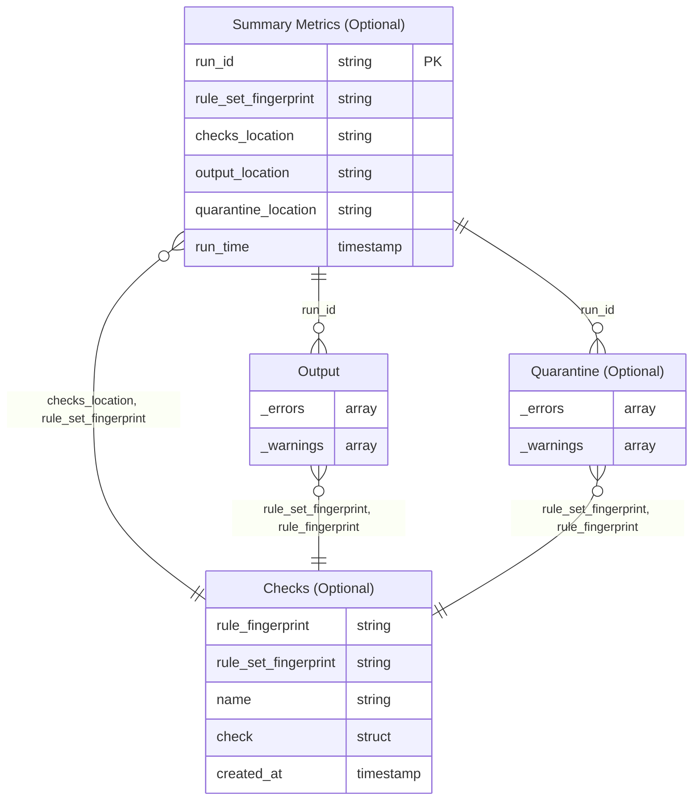

import Admonition from '@theme/Admonition';

# Table Schemas and Relationships

This page provides a reference for the table structures and relationships (EDR diagrams) used by DQX when applying quality checks, storing checks, and recording summary metrics. It describes the relationships between tables and the schema of result columns.

## Overview

When you apply quality checks with DQX:

- **Output table**: Contains rows that passed all checks, plus rows with warnings (warnings do not exclude rows from the output). Each row includes `_errors` and `_warnings` columns (the names can be customized). See [Applying Quality Checks](/docs/guide/quality_checks_apply) for details.
- **Quarantine table** (optional): When configured, rows that fail error-level checks are written to the quarantine table instead of the output table. The quarantine table has the same structure as the output table, including `_errors` and `_warnings`. See [Applying Quality Checks](/docs/guide/quality_checks_apply) for configuration.
- **Checks table**: (optional) Stores the rule definitions. Used for loading checks and for traceability via `rule_fingerprint` and `rule_set_fingerprint`. For filtering `run_config_name` is used. See [Loading and Storing Quality Checks](/docs/guide/quality_checks_storage) for details.
- **Summary metrics table** (optional): When enabled, stores aggregate metrics per run (e.g. `input_row_count`, `error_row_count`). Links to output/quarantine via `run_id` and to the checks table via `checks_location` and `rule_set_fingerprint`. See [Summary Metrics](/docs/guide/summary_metrics) for configuration.

<Admonition type="info" title="Output vs Quarantine">
When **quarantine is configured**: Rows with errors go to the quarantine table; rows with only warnings or no issues go to the output table. When **quarantine is not configured**: All rows (including those with errors) go to the output table. In both cases, **warnings are always included in the output** — rows with warnings appear in the output table, and if a row has both errors and warnings, it goes to quarantine (when configured) with both `_errors` and `_warnings` populated.
</Admonition>

## Table relationships

The following EDR diagram shows how tables relate:

- **Summary metrics → Output/Quarantine**: Join on `run_id` (present in each `_errors` and `_warnings` item).
- **Summary metrics → Checks table**: Use `checks_location` and `rule_set_fingerprint` to load the rule set.
- **Output/Quarantine → Checks table**: Join exploded `_errors`/`_warnings` on `rule_fingerprint` and `rule_set_fingerprint`.

## Result columns: `_errors` and `_warnings`

The output and quarantine tables include two array columns appended by DQX (see [Applying Quality Checks](/docs/guide/quality_checks_apply#detailed-quality-checking-results) for usage details):

| Column    | Type   | Description                                                                 |
| --------- | ------ | --------------------------------------------------------------------------- |
| `_errors` | ARRAY  | Array of structs describing error-level check failures for this row.        |
| `_warnings` | ARRAY | Array of structs describing warning-level check failures for this row.      |

Each element in `_errors` and `_warnings` has the following structure:

| Field                 | Type      | Description                                                                 |
| --------------------- | --------- | --------------------------------------------------------------------------- |
| `name`                | STRING    | Name of the check.                                                          |
| `message`             | STRING    | Message describing the quality issue.                                       |
| `columns`             | ARRAY     | Column(s) where the issue was found.                                        |
| `filter`              | STRING    | Filter applied to the check, if any.                                        |
| `function`            | STRING    | Check function applied (e.g. `is_not_null`).                                |
| `run_time`            | TIMESTAMP | When the check was executed.                                                |
| `run_id`              | STRING    | Unique run ID; links to summary metrics.                                    |
| `user_metadata`       | MAP       | Optional user-defined metadata.                                             |
| `rule_fingerprint`    | STRING    | SHA-256 hash of the single rule; links to checks table.                     |
| `rule_set_fingerprint`| STRING    | SHA-256 hash of the rule set; links to checks table.                        |

## Checks table schema

When storing checks in Delta or Lakebase tables (see [Loading and Storing Quality Checks](/docs/guide/quality_checks_storage)), the schema is:

| Column                 | Type                                                         | Description                                                                 |
| ---------------------- | ------------------------------------------------------------ | --------------------------------------------------------------------------- |
| `name`                 | STRING                                                       | Name of the check.                                                          |
| `criticality`          | STRING                                                       | `error` or `warn`.                                                          |
| `check`                | STRUCT&lt;function STRING, for_each_column ARRAY&lt;STRING&gt;, arguments MAP&lt;STRING, STRING&gt;&gt; | Check definition: function name, optional `for_each_column`, and keyword arguments for the function. The `arguments` map must include every required parameter of that check function (parameters without a default in its signature); `for_each_column` can supply `column` or `columns` when applicable. |
| `filter`               | STRING                                                       | Optional filter expression.                                                 |
| `run_config_name`      | STRING                                                       | Run configuration name for filtering (e.g. input table or job name).        |
| `user_metadata`        | MAP&lt;STRING, STRING&gt;                                    | Optional user-defined metadata.                                             |
| `created_at`           | TIMESTAMP                                                    | When the check was saved.                                                   |
| `rule_fingerprint`     | STRING                                                       | SHA-256 hash of the single rule.                                            |
| `rule_set_fingerprint` | STRING                                                       | SHA-256 hash of the complete rule set.                                      |

## Summary metrics table schema

Summary metrics are optional. When enabled (see [Summary Metrics](/docs/guide/summary_metrics)), the schema is:

| Column                 | Type                 | Description                                                                 |
| ---------------------- | -------------------- | --------------------------------------------------------------------------- |
| `run_id`               | STRING               | Unique run ID; links to output/quarantine `_errors`/`_warnings`.            |
| `run_name`             | STRING               | Name of the metrics observer.                                               |
| `input_location`       | STRING               | Input dataset location (table or file).                                     |
| `output_location`      | STRING               | Output table location.                                                      |
| `quarantine_location`  | STRING               | Quarantine table location, if used.                                         |
| `checks_location`      | STRING               | Where checks were loaded from (table or file).                              |
| `rule_set_fingerprint` | STRING               | SHA-256 hash of the rule set; links to checks table.                        |
| `metric_name`          | STRING               | Metric name (e.g. `input_row_count`, `error_row_count`).                    |
| `metric_value`         | STRING               | Metric value (stored as string).                                            |
| `run_time`             | TIMESTAMP            | When the run completed / check applied.                                     |
| `error_column_name`    | STRING               | Name of the error column (default: `_errors`).                              |
| `warning_column_name`  | STRING               | Name of the warning column (default: `_warnings`).                          |
| `user_metadata`        | MAP&lt;STRING, STRING&gt; | Optional run-level metadata.                                           |

The summary table stores one row per metric per run (long format). Use `run_id` to correlate with row-level results and `rule_set_fingerprint` with the checks table.
