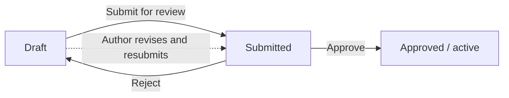

import Admonition from '@theme/Admonition';
import ThemedImage from '@theme/ThemedImage';
import useBaseUrl from '@docusaurus/useBaseUrl';

# The approval workflow (four-eyes)

This page is for approvers and admins. It explains how a change goes from an idea
to something that affects a real run, and why a second person always signs off
first. Authors get value here too: you'll see exactly what happens after you
submit your work.

## The lifecycle

Every rule, monitored table, and collection moves through the same simple states:

1. **Draft** — someone is authoring or editing it. It has no effect on any run yet.
2. **Submitted for review** — the author is done and asks for a second pair of eyes.
3. **Approved / active** — a reviewer has approved it. It's now live and counts in runs.

A reviewer can also send a submission back. When that happens it returns to draft
with a reason, so the author can fix it and resubmit.

## The four-eyes principle

**An author can't approve their own submission** unless they are also an approver
or admin. In practice that means at least two people touch every change before it
affects a run: the person who wrote it, and the person who approved it.

This is a guardrail, not red tape. A single mistake in a rule can quietly break
data quality reporting or, worse, cause false failures that make good data look
bad. A second reviewer catches the obvious slips — a typo in a column name, a
threshold set too high, a check applied to the wrong table — before they reach a
live run. The cost is one quick review; the payoff is that no one person can take
down quality reporting on their own.

<Admonition type="note" title="If you're both author and approver">
Approvers and admins can approve their own drafts, so a small team isn't blocked.
The four-eyes rule only stops authors who don't already hold approval rights from
self-approving.
</Admonition>

## The reviewer experience

Open **Review & Approve** to see everything waiting on you. Pending rules,
monitored tables, and collections are grouped so you can work through them in one
place.

<ThemedImage
  alt="Review & Approve page listing a pending rule with Approve, Reject, and View changes actions"
  sources={{
    light: useBaseUrl('/img/studio/review_approve_light.png'),
    dark: useBaseUrl('/img/studio/review_approve_dark.png'),
  }}
/>

For any item, choose **View changes** to see the proposed definition. If the item
already has a live version, you'll see a diff — what's changing, side by side with
what's active today — so you can focus on exactly what's new.

From here you can:

- **Test it** (optional) against sample rows first, so you can see how the change
  behaves before it goes live. No data is changed and nothing is saved.
- **Approve** it, with a comment for the record. The item becomes active and
  counts in the next run.
- **Reject** it, with a reason. The item goes back to the author as a draft.

Every approval and rejection is recorded — who acted, when, and what changed — so
there's always a clear trail.

## The author experience

When your draft is ready, choose **Submit for review**. After that you can track
its status: still pending, approved and active, or sent back to you.

If a reviewer rejects a submission, it returns to you as a draft with their reason
attached. Fix what they flagged and resubmit — it goes back into the same review
queue.

<Admonition type="tip" title="Small edits still need a review">
Editing a rule that's already active creates a new draft version. The live
version keeps working until your edit is reviewed and approved, so you can't
accidentally disrupt a running check while you tweak it.
</Admonition>

## When approvals are turned off

An admin decides whether approvals are **required** (recommended) or **off**
(auto-approve). Requiring approval is the right default for anything that feeds
real reporting. Turning it off suits a trusted or development environment where
speed matters more than a second sign-off.

When approvals are disabled, the review queue is hidden and submissions go live
immediately — there's nothing to approve. This choice is itself an admin setting
and, like every other change, it's audited.

<Admonition type="info" title="Where to set this">
Admins choose the approvals mode when they
[set up DQX Studio for your organization](/docs/studio/governance/).
</Admonition>
