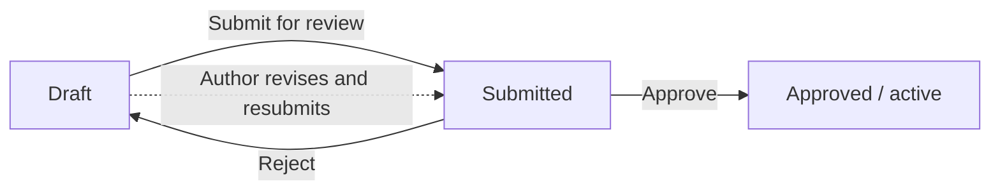

import Admonition from '@theme/Admonition';
import ThemedImage from '@theme/ThemedImage';
import useBaseUrl from '@docusaurus/useBaseUrl';

# The approval workflow (four-eyes)

Every rule, monitored table, and collection moves through the same simple states
before it can affect a run:

1. **Draft** — someone is authoring or editing it. No effect on any run yet.
2. **Submitted for review** — the author is done and asks for a second pair of eyes.
3. **Approved / active** — a reviewer has approved it. It's now live and counts in runs.

A reviewer can also send a submission back to draft with a reason, so the author
can fix it and resubmit.

```mermaid
flowchart LR
  A[Draft] -->|Submit for review| B[Submitted]
  B -->|Approve| C[Approved / active]
  B -->|Reject| A
  A -.->|Author revises and resubmits| B
```

## The four-eyes principle

**An author can't approve their own submission** unless they're also an approver
or admin. In practice at least two people touch every change — the person who
wrote it and the person who approved it. A second reviewer catches the obvious
slips (a typo in a column name, a threshold set too high, a check on the wrong
table) before they reach a live run.

<Admonition type="note" title="Small teams aren't blocked">
Approvers and admins can approve their own drafts, so a small team isn't stuck.
The rule only stops authors *without* approval rights from self-approving.
</Admonition>

## The reviewer experience

Open **Review & Approve** to see everything waiting on you — pending rules,
tables, and collections, grouped in one place. For any item, choose **View
changes** to see the proposed definition; if it already has a live version you'll
see a **diff** against what's active today.

<ThemedImage
  alt="Review & Approve page listing a pending rule with Approve, Reject, and View changes actions"
  sources={{
    light: useBaseUrl('/img/studio/review_approve_light.png'),
    dark: useBaseUrl('/img/studio/review_approve_dark.png'),
  }}
/>

From there you can **test it** against sample rows first (nothing is changed or
saved), **approve** it with a comment (it becomes active and counts in the next
run), or **reject** it with a reason (it returns to the author as a draft). Every
approval and rejection is recorded — who acted, when, and what changed.

## The author experience

When your draft is ready, choose **Submit for review**, then track its status:
pending, approved and active, or sent back. If it's rejected, it returns as a
draft with the reviewer's reason attached — fix what they flagged and resubmit.

<Admonition type="tip" title="Editing an active item is safe">
Editing something that's already active creates a new draft version. The live
version keeps working until your edit is reviewed and approved, so you can't
accidentally disrupt a running check while you tweak it.
</Admonition>

## When approvals are turned off

An admin decides whether approvals are **required** (recommended for anything
feeding real reporting) or **off** (auto-approve, suited to a trusted or
development environment). When they're off, the review queue is hidden and
submissions go live immediately. This choice is itself an audited admin setting —
set it when you
[set up DQX Studio for your organization](/docs/studio/governance/).
