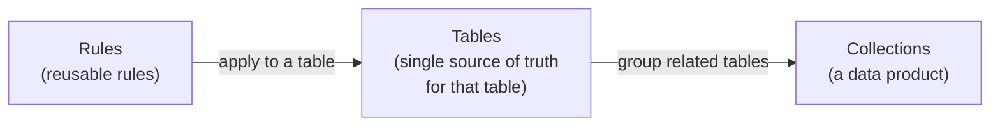

import Admonition from '@theme/Admonition';
import ThemedImage from '@theme/ThemedImage';
import useBaseUrl from '@docusaurus/useBaseUrl';

# DQX Studio

<Admonition type="info" title="Beta">
DQX Studio is in **Beta**. It's ready to use, but features and screens may still
change between releases.
</Admonition>

**DQX Studio is a no-code web app for data quality.** It lets you define the
rules your data should follow, run them against your tables, and see — at a
glance — whether your data can be trusted. All from a browser, with no code to
write or maintain.

It runs inside your own Databricks workspace as a
[Databricks App](https://docs.databricks.com/en/dev-tools/databricks-apps/index.html),
so it uses your Databricks sign-in and only ever shows you data you already have
access to.

<ThemedImage
  alt="DQX Studio home page showing overall data quality score and a quality trend chart"
  sources={{
    light: useBaseUrl('/img/studio/home_light.png'),
    dark: useBaseUrl('/img/studio/home_dark.png'),
  }}
/>

## Who it's for

DQX Studio is built for the people accountable for data quality — **data
stewards**, **data governance managers**, and the analysts and owners who work
with them — not just engineers. If you can describe what "good data" looks like
("customer email should never be blank", "an order amount can't be negative"),
you can use DQX Studio to enforce it.

<Admonition type="note" title="Prefer to work in code?">
DQX Studio is the no-code experience. If you'd rather define and run checks from
Python in your pipelines and notebooks, see [DQX Core](/docs/guide/) — the same
data-quality engine, exposed as a Python package.
</Admonition>

## Key concepts

You only need a handful of ideas to feel at home in DQX Studio.

### Rules, checks, and tests {#rules-checks-and-tests}

| Term | What it is | Example |
| ---- | ---------- | ------- |
| **Rule** | A reusable definition of an expectation about your data. You write it once and reuse it. | "This column is never blank." |
| **Check** | A rule *applied to a specific column on a specific table*. One rule can become many checks. | "`customers.email` is never blank." |
| **Test** | A single evaluation of a check against one row (or one aggregate) during a run. | Checking `email` on row 42 — one test. |

So one rule can become several checks, and each check produces one test per row
when it runs. The headline **DQ score** is the **average test pass rate** across
all checks, and a collection's score is the average across its member tables. See
[Review results](/docs/studio/running/#read-the-score).

### The three levels: Rules → Tables → Collections

DQX Studio has three levels that build on each other:

1. **Rules Registry** — your library of reusable rule definitions. Write a rule
   once ("an amount is never negative") and reuse it across many tables, so your
   organization defines each expectation once and updates it in one place.
2. **Monitored table** — a Unity Catalog table you've applied rules to. It's the
   single source of truth for that table's data quality: which rules apply, how
   strict they are, and how it's scoring.
3. **Collection** — a *data product*: related monitored tables grouped so you can
   view, run, and schedule them together (for example the `customers`, `orders`,
   and `payments` tables behind one dashboard or Genie space). Collections are
   optional — reach for them once you have related tables to report on as one
   product.

### Severity {#severity}

Every rule has a **severity** — a customizable **Low / Medium / High / Critical**
priority that says how much a failure matters. Severity drives triage and
reporting ("show me the critical failures first"); it does **not**, by itself,
decide whether a run is good or bad — that's what
[pass thresholds](/docs/studio/monitoring/assign-rules#quality-thresholds) are
for. You set a default when you write a rule and can override it per table.

<Admonition type="note" title="How severity maps to DQX Core">
Under the hood DQX Core has two outcomes for a failing check — **warning** and
**error**. By default **Low** and **Medium** map to *warning* and **High** and
**Critical** map to *error*; that mapping is configurable in the Admin pages.
</Admonition>

### Quality dimensions {#quality-dimensions}

Each rule is tagged with the **dimension** of quality it measures, so you can
report by category: **completeness** (is data present?), **validity** (right
shape?), **accuracy** (within bounds?), **consistency** (agrees with related
data?), **uniqueness** (no unwanted duplicates), and **timeliness** (recent, not
in the future).

### Roles and the rule lifecycle

What you can do depends on your **role** — **Viewer**, **Rule Author**, **Rule
Approver**, or **Admin**. Rules don't go live the moment you write them: a rule
starts as a **draft**, is **submitted for review**, and becomes **active** only
once an approver signs off. This "four-eyes" step means at least two people touch
every rule before it affects a run. See
[Permissions & entitlements](/docs/studio/governance/permissions-and-entitlements)
and the [Approval workflow](/docs/studio/governance/approval-workflow).

<Admonition type="tip" title="A couple of reassurances">
**DQX Studio never changes your data** — a failing check only reports which rows
didn't pass. And **you only ever see what you already have access to**, because
the app browses Unity Catalog as you.
</Admonition>

## What do you want to do?

- **See whether your data is healthy** → open
  [Review results](/docs/studio/running/).
- **Add a new rule** → follow the
  [Quickstart](/docs/studio/quickstart), or jump to
  [Create a rule](/docs/studio/authoring/create-a-rule).
- **Roll DQX Studio out across your organization** →
  [Set up DQX Studio for your organization](/docs/studio/governance/).

<Admonition type="tip" title="New here?">
The [Quickstart](/docs/studio/quickstart) takes you from an empty
screen to your first monitored table in about ten minutes.
</Admonition>

## In this section

- **[Quickstart](/docs/studio/quickstart)** — your first monitored table in about
  ten minutes.
- **Authoring rules** — [create a rule](/docs/studio/authoring/create-a-rule)
  (built-in checks, AI generation, profiling, and governed tags), plus its
  subpages [cross-table rules](/docs/studio/authoring/create-a-rule/cross-table-rules)
  and [row-level vs table-level](/docs/studio/authoring/create-a-rule/row-and-table-level);
  [import rules](/docs/studio/authoring/import-rules); and the
  [Marketplace](/docs/studio/authoring/marketplace).
- **Monitor your tables** — [monitor a table](/docs/studio/monitoring/),
  [assign rules](/docs/studio/monitoring/assign-rules) (with quality
  thresholds), [profiling](/docs/studio/monitoring/profiling),
  [collections](/docs/studio/monitoring/collections), and
  [run checks & schedule](/docs/studio/monitoring/run-and-schedule).
- **[Review results](/docs/studio/running/)** — read the DQ score, drill into the
  breakdowns and failing records, and ask Genie about your quality.
- **Governance & security** — [set up for your
  organization](/docs/studio/governance/),
  [permissions & entitlements](/docs/studio/governance/permissions-and-entitlements),
  and the [approval workflow](/docs/studio/governance/approval-workflow).
