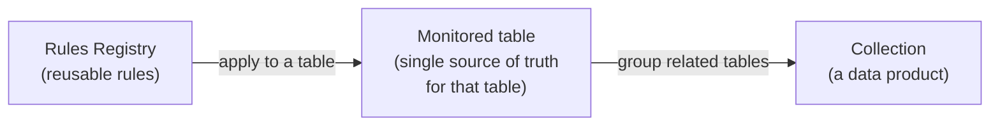
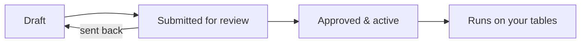

import Admonition from '@theme/Admonition';
import ThemedImage from '@theme/ThemedImage';
import useBaseUrl from '@docusaurus/useBaseUrl';

# Key concepts

You only need a handful of ideas to feel at home in DQX Studio. This page
explains them once; the rest of the guide links back here instead of repeating
them.

## Rules, checks, and tests

These three words sound similar but mean different things, and the difference
matters when you read a quality score.

| Term | What it is | Example |
| ---- | ---------- | ------- |
| **Rule** | A reusable definition of an expectation about your data. You write it once and reuse it. | "This column is never blank." |
| **Check** | A rule *applied to a specific column on a specific table*. One rule can become many checks. | "`customers.email` is never blank." |
| **Test** | A single evaluation of a check against one row (or one aggregate) during a run. | Checking `email` on row 42 — one test. |

So one rule ("is never blank") can become several checks (on `email`, on
`phone`, on `name`), and each check produces one test per row when it runs. A
run of one check over a million rows is a million tests. That's why a score can
read **"421,121 failed of 2,350,000 tests"** — it's counting individual
row-level evaluations, not rules.

<Admonition type="tip" title="Rule → check → test, in one sentence">
You **write a rule**, **apply it to a table as a check**, and each time it runs
it produces one **test** per row.
</Admonition>

## The three levels: Registry → tables → collections

DQX Studio is organized into three levels that build on one another. This is the
single most useful thing to understand.

### 1. Rules Registry — your library of reusable rules

The **Rules Registry** is a shared library of rule definitions. You write a rule
once — "an amount is never negative", "a country code is a valid ISO code" — and
it lives in the Registry ready to be reused. Rules here aren't tied to any one
table yet; they're templates.

Keeping rules in a library (rather than re-writing the same "not blank" check on
every table) means your organization defines each expectation *once*, applies it
consistently, and updates it in one place.

<ThemedImage
  alt="The Rules Registry — a library of reusable data quality rules"
  sources={{
    light: useBaseUrl('/img/studio/rules_list_light.png'),
    dark: useBaseUrl('/img/studio/rules_list_dark.png'),
  }}
/>

### 2. Monitored table — the single source of truth for one table

A **monitored table** is a real table in Unity Catalog that you've applied rules
to. When you apply rules from the Registry to a table, you create checks on its
columns — and that table becomes the single place to see and manage everything
about *that* table's data quality: which rules apply, how strict they are, and
how it's scoring.

### 3. Collection — a data product spanning related tables

A **collection** groups several related monitored tables into a **data product**
you can look at, run, and schedule *together*. A collection isn't just a way to
schedule runs — its real value is letting you see quality **across related
tables at once**.

For example, a "Customer 360" collection might bundle the `customers`, `orders`,
and `payments` tables that feed a Genie space or a published data product. One
collection view then shows you the combined quality of everything behind that
product.

<ThemedImage
  alt="A collection's results — combined data quality across its member tables"
  sources={{
    light: useBaseUrl('/img/studio/collection_results_light.png'),
    dark: useBaseUrl('/img/studio/collection_results_dark.png'),
  }}
/>

<Admonition type="note" title="Collections are optional at first">
You don't need a collection to get value from DQX Studio. Monitor a table or two
first; reach for collections once you have a group of related tables you want to
run and report on as one data product. See
[Collections](/docs/studio/monitoring/collections).
</Admonition>

## Errors and warnings

Every check has a **severity**:

- **Error** — a serious problem. If the check doesn't pass, the run is marked as
  failing.
- **Warning** — worth knowing about, but it won't fail the run.

You set a default severity when you write a rule, and you can override it for a
specific table when you apply it.

## Quality dimensions

Each rule is tagged with the **dimension** of quality it measures, so you can
report on quality by category:

- **Completeness** — is data present? (not blank)
- **Validity** — is it in the right shape? (matches a format, an allowed list)
- **Accuracy** — is it correct? (within expected bounds)
- **Consistency** — does it agree with related data?
- **Uniqueness** — no unwanted duplicates.
- **Timeliness** — is it recent / not in the future?

## Pass thresholds

Real data is rarely perfect. A **pass threshold** lets a check tolerate some
failures before it's marked as failing — for example, "at least 70% of rows must
pass". This supports gradual improvement: accept 70% today, tighten to 95% as
the data gets cleaner. See
[Set quality thresholds](/docs/studio/monitoring/quality-thresholds).

## The lifecycle of a rule

Rules don't go live the moment you write them. They move through a short,
reviewable lifecycle:

A rule starts as a **draft**, is **submitted for review**, and becomes
**active** only once an approver signs off. This "four-eyes" step means at least
two people touch every rule before it affects a run. See the
[Approval workflow](/docs/studio/governance/approval-workflow).

## Roles

What you can do depends on your **role**:

- **Viewer** — browse rules, tables, and results. Read-only.
- **Rule Author** — everything a viewer can do, plus create and edit their own
  draft rules.
- **Rule Approver** — everything an author can do, plus approve or reject
  anyone's drafts.
- **Admin** — everything, plus workspace settings.

There's also a separate **Runner** privilege that lets someone trigger runs. It's
added on top of any role — so a viewer can be given the ability to run checks
without being able to author them. See
[Roles & permissions](/docs/studio/governance/roles-and-permissions).

## A few reassurances

- **DQX Studio never changes your data.** It reads your tables and evaluates
  rules against them. A failing check never edits or deletes anything — it just
  reports which rows didn't pass.
- **You only see what you already have access to.** DQX Studio browses Unity
  Catalog as you. If a table isn't in the list, it's a permissions matter, not a
  bug — ask whoever grants access in your workspace.

<Admonition type="tip" title="Keep going">
Ready to try it? The [Quickstart](/docs/studio/start-here/quickstart) walks you
through your first rule and monitored table end to end.
</Admonition>
